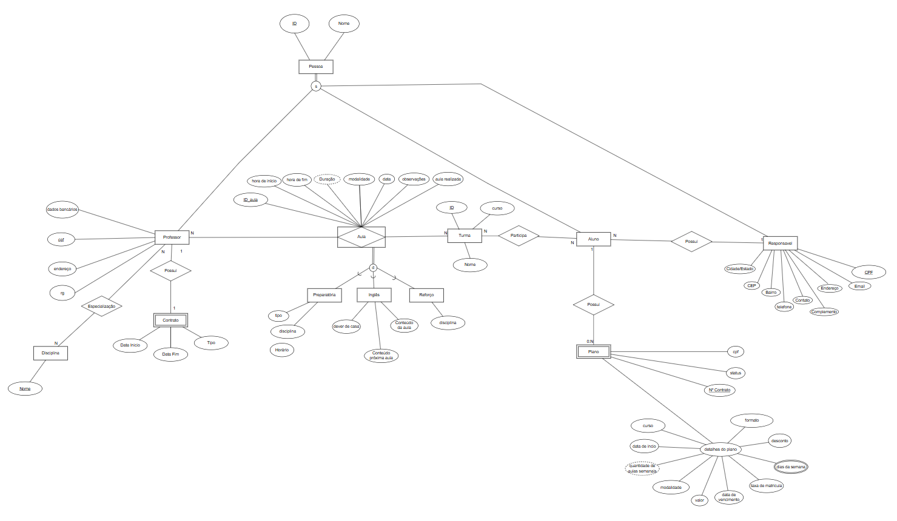
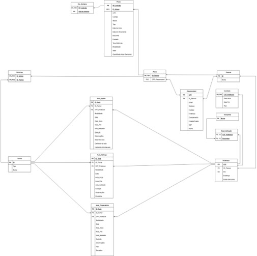

# PONTIFÍCIA UNIVERSIDADE CATÓLICA DE MINAS GERAIS
## Instituto de Ciências Exatas e Informática

---

# PROJETO DE BANCO DE DADOS ESCOLA HELP

**Belo Horizonte**  
2025  

---

**Ana Cecília Souza Lorens**  
**Álvaro Félix da Silva**  
**Augusto Henrique Gonçalves Valbonetti**  
**Leonardo Andrade Caetano Dornelas**  
**Vitor Martins Gonçalves**  
**Walker Junio Gonzaga Rocha**

---

# PROJETO DE BANCO DE DADOS ESCOLA HELP

Trabalho apresentado ao Instituto de Ciências Exatas e Informática da Pontifícia Universidade Católica de Minas Gerais como requisito parcial para avaliação semestral.  

**Orientador:** Prof. Dr. Marco Paulo Soares Gomes.  

**Belo Horizonte – 2025**

---

## RESUMO

O presente relatório apresenta o projeto do banco de dados **SAM (Sistema Acadêmico de Matrícula)**. Especificamente, o relatório apresenta o resultado das atividades de **especificação do minimundo**, **análise de requisitos**, **projeto conceitual**, **projeto lógico** e **projeto físico** do SAM versão 1.0 (v1.0).

As informações necessárias para a realização das atividades de modelagem foram coletadas a partir de especificações textuais fornecidas pelo usuário final. O banco de dados SAM (v1.0) foi concebido dentro do paradigma relacional utilizando como base o modelo relacional, sendo constituído por um conjunto de **cinco entidades**, **cinco relacionamentos** e uma média de **quatro atributos por entidade**.

Além disso, as entidades e relacionamentos conceituais deram origem a um esquema de implementação composto por **sete tabelas** e **sete restrições de integridade referencial** entre elas. Fisicamente, o banco de dados é composto por **sete arquivos indexados** com índice em cada um dos campos correspondentes às chaves primárias das tabelas de origem. Adicionalmente, existem índices para cada uma das chaves estrangeiras para acelerar o processamento de transações sobre os arquivos.

**Palavras-chave:** Banco de Dados; Modelagem; Sistema Acadêmico; Projeto Relacional; Minimundo.

---

## INTRODUÇÃO

Instituições de ensino de apoio pedagógico precisam manter seus registros organizados e atualizados a fim de dar suporte a alunos e professores na execução de suas atividades de aprendizagem.  

A escolha da abordagem de banco de dados utilizada para organização e manutenção desses registros acadêmicos influencia a efetividade com que as atividades são desenvolvidas.  

O objetivo do presente trabalho é propor um **projeto de banco de dados para um sistema acadêmico de aulas especializadas** que pode ser utilizado por diversas escolas de apoio pedagógico particular para gerenciar seus processos de matrícula de alunos em turmas e planos de aulas.

Particularmente, propõe-se uma **especificação de minimundo**, **análise de requisitos**, **projeto conceitual**, **projeto lógico** e **projeto físico** do banco de dados, utilizando como base o **modelo relacional** e podendo ser implementado em sistemas gerenciadores de banco de dados (SGBD) relacionais comerciais.

A **Seção 2** apresenta a especificação de minimundo do banco de dados, incluindo uma descrição textual das principais características e restrições de dados.  
A **Seção 3** apresenta o projeto conceitual do banco de dados, incluindo diagrama entidade-relacionamento (ER).  
A **Seção 4** apresenta o projeto lógico do banco de dados, incluindo diagrama relacional.  

---

## 1. ESPECIFICAÇÃO DO MINIMUNDO

Em modelagem de banco de dados, um **minimundo** é a representação simplificada e bem delimitada de uma parte específica do mundo real, recortada para atender ao objetivo de um sistema.  

O minimundo deste projeto descreve um sistema acadêmico para gerenciamento de **alunos, responsáveis, professores, planos, turmas/disciplinas e aulas** nas modalidades **Reforço, Inglês, Pré-ENEM e Pré-CEFET**.

- **Pessoa**: armazena o nome básico. A partir dela, derivam-se os papéis de **Aluno**, **Responsável legal** e **Professor**.
- **Aluno**: identificado pelo ID_PESSOA, com vínculo obrigatório a um Responsável (CPF_RESPONSAVEL).
- **Responsável**: possui CPF, Email, Telefone, Endereço, Complemento, Contato, e pode estar associado a vários alunos.
- **Plano**: representa os contratos acadêmicos e financeiros, com atributos como Endereço, CPF, Status, Tipo, Datas, Desconto, Valor, Modalidade etc.
- **Dia_Semana**: relaciona planos a dias da semana.
- **Turma**: agrupa alunos e professores por tipo de curso (Inglês, Reforço, Preparatório etc.).
- **Aula**: eventos associados a uma turma e professor, com registros de data, duração, modalidade, conteúdo e observações.
- **Aula_Inglês**, **Aula_Reforço**, **Aula_Preparatório**: variações especializadas com dados pedagógicos específicos.
- **Professor**: possui CPF, RG, Endereço e Dados Bancários.
- **Contrato**: define vínculo de trabalho do professor (CLT ou Horista).
- **Especialização**: liga professor a disciplinas.
- **Disciplina**: armazena os nomes das matérias ministradas.

---

## 2. PROJETO CONCEITUAL

Essa seção apresenta o projeto conceitual da Help, descrevendo as principais estruturas e restrições conceituais do banco de dados.  

**Figura 1 – Diagrama ER do modelo conceitual do banco de dados Help**




**Fonte:** [https://drive.google.com/file/d/1yTv-oxq4DCJYTdkRxS52tjXToQKeIKPM/view?usp=sharing](https://drive.google.com/file/d/1yTv-oxq4DCJYTdkRxS52tjXToQKeIKPM/view?usp=sharing)

A Tabela 2 apresenta com mais detalhes os elementos descritos no diagrama. Foram identificadas **5 entidades**, com média de **4 atributos por entidade**, **5 relacionamentos**, e **3 restrições de totalidade**.

---

## 3. PROJETO LÓGICO

Essa seção apresenta o **projeto lógico** do banco de dados Help (v1.0), descrevendo as estruturas e restrições lógicas baseadas no modelo de implementação relacional.

**Figura 2 – Diagrama do modelo de implementação relacional da Help (v1.0)**



**Fonte:** [https://drive.google.com/file/d/1yTv-oxq4DCJYTdkRxS52tjXToQKeIKPM/view?usp=sharing](https://drive.google.com/file/d/1yTv-oxq4DCJYTdkRxS52tjXToQKeIKPM/view?usp=sharing)

Foram mapeadas **14 relações** e identificadas **17 referências entre relações**.  

O diagrama relacional é útil para visualizar de forma compacta as relações e atributos.

---

## 4. CONCLUSÃO

O presente relatório apresentou o projeto do banco de dados para um sistema que pode ser utilizado pela instituição de ensino Help para gerenciar seus processos de marcação de aula, alocação de alunos, turmas e professores.  

Propusemos uma **especificação de minimundo**, **requisitos funcionais e operacionais**, **projeto conceitual**, **lógico** e **físico** do banco de dados, concebido no paradigma relacional e projetado para ser implementado em um **SGBD relacional comercial**.

---

## 5. ANEXOS – SCRIPTS DE BANCO DE DADOS

### 5.1 Criação da Base

```sql
-- CRIANDO A BASE
CREATE DATABASE HELP;

-- 1 - COMANDOS SQL-DDL // 1.1 - Criação das tabelas
USE HELP;
CREATE TABLE Pessoa(ID INT PRIMARY KEY AUTO_INCREMENT, Nome VARCHAR(300));

CREATE TABLE Responsavel(CPF CHAR(14) PRIMARY KEY, 
ID_Pessoa INT NOT NULL, Email VARCHAR(100), 
Telefone VARCHAR(17), Contato VARCHAR(150), 
Endereco VARCHAR(200), Complemento VARCHAR(50), 
Cidade_Estado VARCHAR(50), CEP VARCHAR(10), 
Bairro VARCHAR(100));

CREATE TABLE Aluno(ID_Pessoa INT PRIMARY KEY, 
CPF_Responsavel CHAR(14) NOT NULL);


DROP TABLE Plano;
CREATE TABLE Plano(Num_Contrato INT PRIMARY KEY AUTO_INCREMENT, ID_Aluno INT NOT NULL, 
Endereco VARCHAR(300), CPF CHAR(14), Status_Plano BOOLEAN NOT NULL, 
Tipo VARCHAR(30) COMMENT 'Inglês ou Preparatório', 
Data_Inicio DATE, Data_Vencimento DATE, Formato VARCHAR(30) COMMENT 'Sozinho ou em Grupo', 
Modalidade VARCHAR(30) COMMENT 'Presencial ou Online', 
Valor DECIMAL, Quantidade_Aulas_Semanais INT,
Taxa_Matricula DECIMAL, Desconto DOUBLE);

CREATE TABLE Dia_Semana (Num_Contrato INT, Dia_da_semana VARCHAR(30),
PRIMARY KEY(Num_Contrato, Dia_da_semana));

CREATE TABLE Professor(CPF CHAR(14) PRIMARY KEY, ID_Pessoa INT NOT NULL, RG CHAR(12), 
Endereco VARCHAR(200), Dados_bancarios VARCHAR(200));


CREATE TABLE Contrato(CPF_Professor CHAR(14) PRIMARY KEY,
Data_Inicio DATE, Data_Fim DATE, Tipo VARCHAR(50) COMMENT 'CLT ou Horista');

CREATE TABLE Disciplina(Nome VARCHAR(200) PRIMARY KEY);

CREATE TABLE Especializacoes(CPF_Professor CHAR(14), Disciplina VARCHAR(200),
PRIMARY KEY(CPF_Professor, Disciplina));

CREATE TABLE Turma(ID INT PRIMARY KEY AUTO_INCREMENT, 
Tipo VARCHAR(50) COMMENT 'Inglês, Refoço ou Preparatório', Nome VARCHAR(150));

CREATE TABLE Aula_Ingles(ID_Aula INT PRIMARY KEY AUTO_INCREMENT, 
ID_Turma INT NOT NULL,CPF_Professor CHAR(14) NOT NULL, 
Modalidade VARCHAR(50) COMMENT 'Online ou Presencial', Data_aula DATE,
Hora_Inicio TIME, Hora_Fim TIME, Aula_realizada BOOLEAN, Duracao TIME,
Observacoes VARCHAR(300), Dever_De_Casa VARCHAR(300), 
Conteudo_Da_Aula VARCHAR(300), Conteudo_Proxima_Aula VARCHAR(300));

CREATE TABLE Aula_Reforco(ID_Aula INT PRIMARY KEY AUTO_INCREMENT, 
ID_Turma INT NOT NULL, CPF_Professor CHAR(14) NOT NULL, 
Modalidade VARCHAR(50) COMMENT 'Online ou Presencial', Data_Aula DATE, 
Hora_Inicio TIME, Hora_Fim TIME, Aula_Realizada BOOLEAN, Duracao TIME, 
Observacoes VARCHAR(300), Disciplina VARCHAR(200));

CREATE TABLE Aula_Preparatorio(ID_Aula INT PRIMARY KEY AUTO_INCREMENT, ID_Turma INT NOT NULL, 
CPF_Professor CHAR(14) NOT NULL, Modalidade VARCHAR(50) COMMENT 'Online ou Presencial', 
Data_Aula DATE, Hora_Inicio TIME, Hora_Fim TIME, Aula_Realizada BOOLEAN, Duracao TIME, 
Observacoes VARCHAR(300), Tipo VARCHAR(100), Disciplina VARCHAR(200));

CREATE TABLE Participa(ID_Aluno INT, ID_Turma INT,
PRIMARY KEY(ID_Aluno, ID_Turma));


-- 1 - COMANDOS SQL-DDL // 1.2 - Criação das foreign keys

ALTER TABLE responsavel
ADD CONSTRAINT pessoa_responsavel
FOREIGN KEY (ID_Pessoa)
REFERENCES pessoa(ID)
ON DELETE RESTRICT;


ALTER TABLE aluno
ADD CONSTRAINT pessoa_aluno
FOREIGN KEY (ID_Pessoa)
REFERENCES pessoa(ID)
ON DELETE RESTRICT;

ALTER TABLE aluno
ADD CONSTRAINT resposavel_do_aluno
FOREIGN KEY (CPF_Responsavel) 
REFERENCES Responsavel(CPF)
ON DELETE RESTRICT;

ALTER TABLE plano
ADD CONSTRAINT id_aluno_plano
FOREIGN KEY (ID_Aluno) REFERENCES Aluno(ID_Pessoa)
ON DELETE RESTRICT;

ALTER TABLE Dia_Semana
ADD CONSTRAINT respectivo_dia_semana_num_contrato
FOREIGN KEY (Num_Contrato) REFERENCES Plano(Num_Contrato)
ON DELETE RESTRICT;

ALTER TABLE Professor
ADD CONSTRAINT pessoa_professor
FOREIGN KEY (ID_Pessoa) REFERENCES Pessoa(ID)
ON DELETE RESTRICT;

ALTER TABLE Contrato
ADD CONSTRAINT contrato_do_professor_x
FOREIGN KEY (CPF_Professor) REFERENCES Professor(CPF)
ON DELETE RESTRICT;

ALTER TABLE Especializacoes
ADD CONSTRAINT especializacao_do_professor
FOREIGN KEY (CPF_Professor) REFERENCES Professor(CPF)
ON DELETE RESTRICT;

ALTER TABLE Especializacoes
ADD CONSTRAINT disciplina_dada
FOREIGN KEY (Disciplina) REFERENCES Disciplina(Nome)
ON DELETE RESTRICT;

ALTER TABLE Aula_Ingles
ADD CONSTRAINT professor_que_ministrou_aula_ingles
FOREIGN KEY (CPF_Professor) REFERENCES Professor(CPF)
ON DELETE RESTRICT;

ALTER TABLE Aula_Ingles
ADD CONSTRAINT turma_presente_na_aula_de_ingles
FOREIGN KEY (ID_Turma) REFERENCES Turma(ID)
ON DELETE RESTRICT;

ALTER TABLE Aula_reforco
ADD CONSTRAINT turma_presente_na_aula_de_reforco
FOREIGN KEY (ID_Turma) REFERENCES Turma(ID)
ON DELETE RESTRICT;

ALTER TABLE Aula_reforco
ADD CONSTRAINT professor_que_ministrou_aula_reforco
FOREIGN KEY (CPF_Professor) REFERENCES Professor(CPF)
ON DELETE RESTRICT;

ALTER TABLE Aula_Preparatorio
ADD CONSTRAINT professor_que_ministrou_aula_preparatorio
FOREIGN KEY (CPF_Professor) REFERENCES Professor(CPF)
ON DELETE RESTRICT;

ALTER TABLE Aula_Preparatorio
ADD CONSTRAINT turma_presente_na_aula_preparatorio
FOREIGN KEY (ID_Turma) REFERENCES Turma(ID)
ON DELETE RESTRICT;

ALTER TABLE participa
ADD CONSTRAINT aluno_em_turmas
FOREIGN KEY (ID_Aluno) REFERENCES Aluno(ID_Pessoa)
ON DELETE RESTRICT;

ALTER TABLE participa
ADD CONSTRAINT turma_contem_alunos
FOREIGN KEY (ID_Turma) REFERENCES Turma(ID)
ON DELETE RESTRICT;
